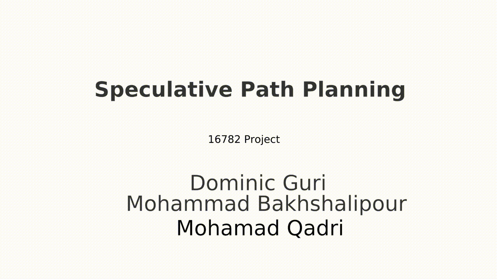

# Speculative Path Planning



This repository provides the source code of *Speculative Path Planning* project, which was conducted as a part of CMU's 16-782 Planning and Decision-making in Robotics coursework. The repository consists of two parts: **Path Planning** and **Visualization**.

## Path Planning

### Usage

#### Compile 

    $ cd path-planning
    $ make

#### Run 
    $ ./run_sensitivity_analysis.sh > script_log.txt
Once the command is issued, various experiments (e.g., different number of threads, different maps, etc.) will start running. The experiments totally take around 14 hours on our system.

#### Results
The results (e.g., execution time, accuracy, etc.) are constantly printed to stdout. Hence, by redirecting the execution log, they can all be captured in a single file. A sample output is placed in `script_log.txt.20201219_184300` file. To plot charts, issue the following command:

    $ ./plot.py script_log.txt
Once the command is issued, all the plots will be shown and saved in the file system. The charts of `script_log.txt.20201219_184300` is placed in `final_plots`.

## Visualization:
This part provides a visualization of our method.

    $ cd visualization

+ The visualization script `animate.py` uses python3 `matplotlib`
+ Default arguments are
  + `  --map   ../path-planning/inputset/map1.txt`
  + `  --soln1 ../path-planning/csv_files/t1-s0/map1.csv`
  + `  --soln2 ../path-planning/csv_files/t16-s0/map1.csv`
  + `  --soln3 ../path-planning/csv_files/t16-s1/map1.csv`

+ An alternative approach:
```bash
cd visualization/
./parallel_2d.sh 1 1 0 16 0 16 1
# 1  - map number
# 1  - display 1 thread solution
# 0  - speculation disabled
# 16 - display 16 thread solution
# 0  - speculation disabled
# 16 - display 16 thread solution
# 1  - speculation enabled
```

For instance, the above command will run simulation to compare the single-threaded solution (baseline), the 16-threaded solution with the speculation disabled, and the 16-threaded solution with the speculation enabled.

